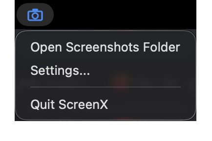
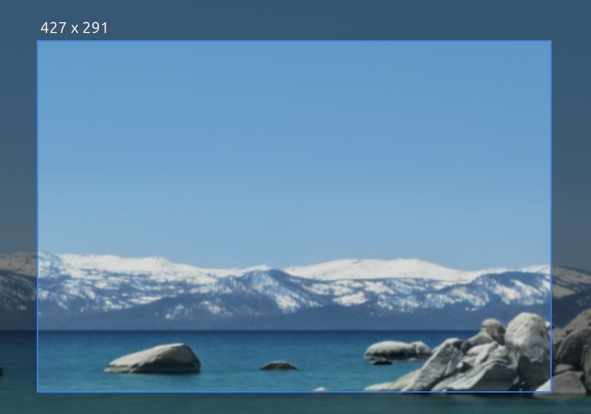

# ScreenX

Take a screenshot. Mark it up. Save it.

ScreenX is a screen capture tool for macOS and Windows. It keeps everything on
your computer. It does not upload your screenshots, it does not need an account,
and it contains no network code.

The application is small. It draws its own window, so it does not contain a
browser.

---

## Contents

- [Install](#install)
- [First run](#first-run)
- [Take a screenshot](#take-a-screenshot)
- [Mark up a screenshot](#mark-up-a-screenshot)
- [Settings](#settings)
- [Name your files](#name-your-files)
- [Keyboard shortcuts](#keyboard-shortcuts)
- [If something does not work](#if-something-does-not-work)
- [For developers](#for-developers)

---

## Install

ScreenX is two programs. One program gives you the tray icon and the keyboard
shortcuts. It starts the second program for each screenshot, and the second
program stops when you close the editor. This keeps the memory low between
screenshots.

### macOS

Download `ScreenX_universal.dmg` from the
[releases page](https://github.com/BrandonDoster/ScreenX/releases).

1. Open the .dmg file.
2. Drag **ScreenX** onto the **Applications** folder.
3. Open Terminal.
4. Run the command below.

```sh
xattr -dr com.apple.quarantine /Applications/ScreenX.app
```

ScreenX is not signed by Apple, so macOS blocks a copy that you download. The
command removes the block. ScreenX now starts normally. You do this one time
only.

### Windows

Download `ScreenX_windows.zip` from the
[releases page](https://github.com/BrandonDoster/ScreenX/releases). There is no
installer.

1. Extract the .zip file.
2. Keep `screenx.exe` and `screenx-capture.exe` in the same folder.
3. Run `screenx.exe`.

The .zip also holds `THIRD-PARTY-LICENSES.html`, which lists the libraries
ScreenX is built from. Nothing reads it and you can delete it.

**Keep the two programs together.** `screenx.exe` starts `screenx-capture.exe`
from the folder that it is in. Your shortcuts do nothing if you move one file
without the other.

The application is not signed. Windows shows a blue **Windows protected your
PC** window the first time. To continue:

1. Click **More info**.
2. Click **Run anyway**.

You do this one time only.

To remove ScreenX, delete the folder. Your settings stay in `%APPDATA%\ScreenX`.
Delete that folder as well to remove them.

---

## First run

ScreenX puts an icon in the menu bar (macOS) or the notification area
(Windows). It has no main window. You use it from that icon or with a keyboard
shortcut.



ScreenX writes a settings file with the default values the first time you start
it. Open it from the menu bar icon to change where your screenshots go.

### macOS asks for permission

macOS must give ScreenX permission to read the screen. ScreenX asks you the
first time that you take a screenshot.

1. Click **Open System Settings** in the window that macOS shows.
2. Turn on **ScreenX** in the **Screen Recording** list.
3. Take the screenshot again.

ScreenX takes no screenshot until you give the permission. It stops and tells
you instead.

If you do not see the window, open **System Settings** yourself. Go to
**Privacy & Security** > **Screen Recording**, then turn on **ScreenX**.

Give the permission to **ScreenX** only. The second program uses the same
permission as the first.

---

## Take a screenshot

### The whole screen

Press **Ctrl + Alt + F**. ScreenX captures the screen that your pointer is on.

### A part of the screen

Press **Ctrl + Alt + A**. The screen freezes and becomes dark.

Hold the mouse button down, drag, then let go. ScreenX shows the size of your
rectangle while you drag.



ScreenX keeps the picture that it took when you pressed the shortcut. Your
screen can change while the overlay is open. The screenshot does not.

While the overlay is open:

| To do this | Do this |
| --- | --- |
| Cancel | Press Esc, or click the right mouse button |

**Esc always cancels.** The overlay covers the menu bar, so you cannot reach the
menu bar icon while the overlay is open.

---

## Mark up a screenshot

The editor opens after each capture. Set `afterCapture` in the settings file to
change this.


### The tools

| Tool | What it does |
| --- | --- |
| **Select** | Not yet available. See [What is not here yet](#what-is-not-here-yet). |
| **Rectangle** | Draw a box. |
| **Ellipse** | Draw a circle or an oval. |
| **Arrow** | Draw an arrow. |
| **Line** | Draw a straight line. |
| **Freehand** | Draw a free line with the mouse. |
| **Highlighter** | Put a transparent colour over an area. |
| **Blur** | Hide an area. The pixels are destroyed. |
| **Pixelate** | Hide an area with large squares. |
| **Text** | Type words on the image. |
| **Step number** | Put a numbered circle on the image. Each click adds the next number. |
| **Crop** | Keep only the area that you drag. |
| **Cut out** | Remove a band, and join the two parts. |

### Blur hides information permanently

Use **Blur** or **Pixelate** to hide a password, a name or an address. Both
tools destroy the pixels. Nobody can get the original back from the saved file.

### How to cut out a band

**Cut out** removes a band from the image and joins the two parts together. Use
it to remove empty space from the middle of a long screenshot.

1. Select the **Cut out** tool.
2. Drag across the part that you want to remove.
3. Let go.

The shape of your drag sets the direction of the cut:

- Drag **wider than tall**. ScreenX removes a **full-height column**.
- Drag **taller than wide**. ScreenX removes a **full-width row**.

ScreenX shows the band in red while you drag. Press Ctrl+Z to undo.

### Colour and size

The second row of the toolbar sets the colour, the fill, the line width and the
text size.

### Change the zoom

The editor shows your screenshot at the size it was on screen. A large
screenshot is made smaller to fit the window. ScreenX never makes a screenshot
larger on its own.

| Control | What it does |
| --- | --- |
| **+** | Zoom in. |
| **-** | Zoom out. |
| The percentage | Click it to go back to the fitted size. |

You can also hold Ctrl and turn the mouse wheel.

### Save your work

| Button | What it does |
| --- | --- |
| **Save** | Write the file to your screenshot folder, and close the editor. |
| **Copy** | Put the image on the clipboard. |
| **Close** | Close the editor. ScreenX stays in the menu bar. |

To save and copy with one click, set `copyImageOnSave` to `true` in the
settings file.

---

## Settings

ScreenX keeps all of its settings in one JSON file. There is no settings
window. Click **Settings...** in the menu bar icon. Your text editor opens the
file.

Save the file after you change it. ScreenX reads the file again for each
screenshot, so you do not restart the program.

### General

| Setting | What it does |
| --- | --- |
| `screenshotFolder` | Where ScreenX writes your files. |
| `afterCapture` | `editor`, `save` or `copy`. |
| `imageFormat` | `png` or `jpg`. PNG keeps all detail. JPEG makes smaller files. |
| `jpegQuality` | 10 to 100. A higher number gives better quality and a larger file. |
| `copyPathAfterSave` | Put the path of the new file on the clipboard. |
| `copyImageOnSave` | Put the image on the clipboard when you click Save in the editor. |

### Capture

`captureDelayMs` sets a delay in milliseconds. The default is 0, which reads
the screen immediately.

The shortcuts never wait. Only the two delayed items in the menu bar icon use
this delay, so an ordinary screenshot stays fast.

Use this setting to take a screenshot of an open menu. A menu closes as soon as
you press a shortcut or as soon as the overlay opens, so a menu cannot be in a
screenshot that you start while the menu is open.

1. Set `captureDelayMs` to 5000.
2. Click **Capture Region After Delay** in the menu bar icon.
3. Open the menu.
4. Wait. ScreenX reads the screen with the menu still shown.

The overlay shows you the picture that ScreenX already took, so the menu is in
it.

### Shortcuts

Write the shortcut as text, for example `Control+Shift+Q`.

ScreenX reads the keys exactly as you write them. If you write Control, you get
Control. ScreenX does not change Control into Command.

A shortcut must have at least one of Control, Shift, Alt or Command. A shortcut
works in every application, so choose a combination that no other application
uses.

### Where the settings file is

- macOS: `~/Library/Application Support/ScreenX/settings.json`
- Windows: `%APPDATA%\ScreenX\settings.json`

ScreenX ignores a setting that it does not know, and uses the default for a
setting that is absent.

---

## Name your files

ScreenX builds each file name from a pattern. The default pattern is:

```
ScreenX_%y-%mo-%d_%h-%mi-%s
```

It gives a name such as `ScreenX_2026-08-07_14-32-05.png`.

Each part that starts with `%` is a token. ScreenX replaces each token with a
value.

| Token | Value | Example |
| --- | --- | --- |
| `%y` | Year, 4 digits | 2026 |
| `%yy` | Year, 2 digits | 26 |
| `%mo` | Month, 2 digits | 08 |
| `%mon` | Month, short name | Aug |
| `%mon2` | Month, full name | August |
| `%d` | Day of the month | 07 |
| `%w` | Day of the week, short | Fri |
| `%w2` | Day of the week, full | Friday |
| `%wy` | Week number | 32 |
| `%h` | Hour, 24-hour clock | 14 |
| `%h12` | Hour, 12-hour clock | 02 |
| `%pm` | AM or PM | PM |
| `%mi` | Minute | 32 |
| `%s` | Second | 05 |
| `%ms` | Millisecond | 042 |
| `%unix` | Seconds since 1 January 1970 | 1786012325 |
| `%i` | A number that counts up | 7 |
| `%ra` | Random letters and digits | k3Bq7zR1pW |
| `%rn` | Random digits | 5820394617 |
| `%rx` | Random hexadecimal digits | 9f3c1a08bd |
| `%guid` | A random unique code | 5f2b8c14-… |
| `%t` | Name of the window or the screen | Example Window |
| `%width` | Width of the image | 1920 |
| `%height` | Height of the image | 1080 |
| `%un` | Your user name | you |
| `%cn` | Name of your computer | laptop |
| `%pn` | Name of this application | ScreenX |

### Set the width of a token

Put a number in braces after the token.

- `%i{4}` gives `0007`.
- `%ra{6}` gives 6 random characters.

### Rules

- ScreenX removes each character that a file name cannot contain.
- ScreenX never writes over a file. It adds ` (2)`, ` (3)` and so on.
- If you make a mistake in a token, the token stays in the name. This shows you
  the mistake.

---

## Keyboard shortcuts

### Anywhere

| Keys | Action |
| --- | --- |
| Ctrl + Alt + F | Capture the whole screen |
| Ctrl + Alt + A | Capture a region |

These are the defaults. Change them in the settings file.

### In the selection overlay

| Keys | Action |
| --- | --- |
| Esc | Cancel |
| Right click | Cancel |

### In the editor

| Keys | Action |
| --- | --- |
| Ctrl/Cmd + Z | Undo |
| Ctrl/Cmd + Shift + Z | Redo |
| Ctrl/Cmd + C | Copy the image |
| Ctrl/Cmd + S | Save |
| Ctrl/Cmd + mouse wheel | Zoom in or out |
| Esc | Close the editor |

---

## If something does not work

### macOS says it cannot verify ScreenX

macOS shows **"ScreenX" Not Opened** and says Apple could not verify ScreenX is
free of malware. ScreenX is not signed by Apple, and macOS marks applications
that you download.

**Click Done. Do not click Move to Trash**, although it is the highlighted
button. Then remove the mark and start ScreenX again:

```sh
xattr -dr com.apple.quarantine /Applications/ScreenX.app
```

You do this once for each copy you download. See [Install](#install).

### My screenshots are blank or black

**macOS:** give ScreenX permission to read the screen. See
[macOS asks for permission](#macos-asks-for-permission). Without the
permission macOS gives ScreenX your desktop picture with no windows in it.

**Windows:** a game in full-screen mode can capture as black. Set the game to
borderless-window mode.

### My shortcut does nothing

Another application has taken the same combination. Open the settings file from
the menu bar icon and choose a different combination. ScreenX writes a message
to its output if the system refuses one.

**On Windows, check the two files first.** `screenx.exe` needs
`screenx-capture.exe` in the same folder. The tray icon works without it, and
the shortcuts do nothing.

### My shortcut does nothing while a menu is open

An open menu takes the keyboard from every other program, so ScreenX does not
receive the shortcut until the menu closes. This is a rule of the operating
system and ScreenX cannot change it.

Use **Capture Region After Delay** in the menu bar icon instead. Set
`captureDelayMs` first. See [Capture](#capture).

To take a screenshot of a menu, set a capture delay. Read
[Capture](#capture) in the settings section.

### The overlay is on the screen and I cannot remove it

Press **Esc**. ScreenX holds the Esc key for as long as the overlay is open.

### The editor is slow with a very large image

Click the percentage in the toolbar. ScreenX fits the image to the window. This
does not change the saved image.

---

## For developers

- [`docs/TECHNICAL.md`](docs/TECHNICAL.md) — how ScreenX works inside: the
  architecture, the data flow, the coordinate systems, and how to build it.
- [`AGENTS.md`](AGENTS.md) — a map of the code for AI coding assistants.

Quick start:

```sh
cargo run -p screenx --bin screenx            # run it
cargo test --manifest-path core/Cargo.toml    # capture, naming and settings
cargo test --manifest-path app/Cargo.toml     # editor, edits and overlay
./app/bundle.sh                               # make the macOS application
```

---

## What is not here yet

**A second monitor.** ScreenX reads your main monitor only. A screenshot of a
second monitor is not possible yet.

**The window highlight.** An earlier version let you rest the pointer on a
window and click once to capture that window. Drag a rectangle instead.

**The Select tool.** It is in the toolbar, but it does nothing yet. You cannot
move or delete an item after you draw it. Press Ctrl+Z to remove the last one.

**A settings window.** Settings are a JSON file that you edit yourself. The
menu bar icon opens it. This keeps the program small, and it is not planned to
change.

**Save As.** The editor writes to your screenshot folder. Choose the folder in
the settings file.

**A wide test on Windows.** ScreenX now runs on Windows. Screenshots, the
selection overlay, the editor, the keyboard shortcuts, the menu and the icon
were all used on Windows 11 with two monitors. Only that one computer was used.
Report what you see on other hardware.

**A screenshot across two monitors.** ScreenX reads the main monitor only. A
selection cannot cross onto a second monitor.

**GIF recording.** An earlier version had it. It is paused until the screenshot
side is complete.

**A signed application.** The build is unsigned, and there is no plan to sign
it. An Apple Developer ID costs 99 USD each year, which this project does not
spend. This is why you run one command after you install on macOS.

**A Homebrew cask.** ScreenX had one. Homebrew is ending support for casks that
do not pass Gatekeeper, and a build passes Gatekeeper only if Apple signs it.
Install from the .dmg instead.

---

## Licence

ScreenX: local screen capture and annotation.
Copyright © 2026 Brandon Doster.

ScreenX is free software. You can share it and change it under the terms of the
GNU General Public License, version 3. See [`LICENSE`](LICENSE).

ScreenX has no warranty.

### Third-party code

ScreenX draws its own window and contains no browser, so the libraries it is
built from are compiled into the two binaries rather than loaded from your
system. They are all under permissive licences — MIT for most, then Apache-2.0,
BSD, ISC, Zlib, MPL-2.0 and a few others — and every one of those licences asks
that its copyright notice travel with each copy.

`THIRD-PARTY-LICENSES.html` is where they travel. It is built during the release
rather than kept in this repository, because a checked-in copy goes stale the
first time a dependency moves. Every release ships it: inside the .zip on
Windows, and inside the bundle on macOS at `ScreenX.app/Contents/Resources/`.

To read it without downloading a release, or after changing a dependency:

```sh
cargo install cargo-about --features cli
cargo about generate --manifest-path app/Cargo.toml app/about.hbs \
    -o THIRD-PARTY-LICENSES.html
```

What goes in it is set by [`app/about.toml`](app/about.toml), and how it reads
by [`app/about.hbs`](app/about.hbs).

**The fonts are not under the GPL.** Text drawn onto a screenshot is rendered
with Ubuntu Light, which egui embeds and which is under the Ubuntu Font Licence
1.0. That licence allows the font to be embedded and redistributed, but does not
allow it to be released under any other licence, so it keeps its own. The same
holds for the other fonts egui carries: Hack under the MIT licence, and Noto
Emoji under the SIL Open Font Licence 1.1. All of them are free software, none
of them is covered by ScreenX's GPL-3.0, and the full text of each is in
`THIRD-PARTY-LICENSES.html`.
