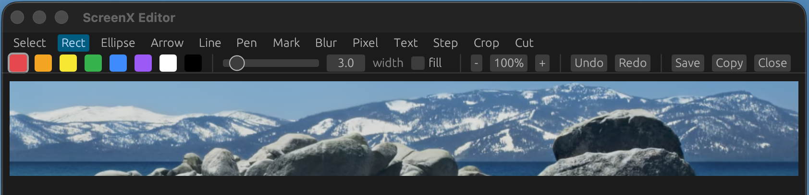
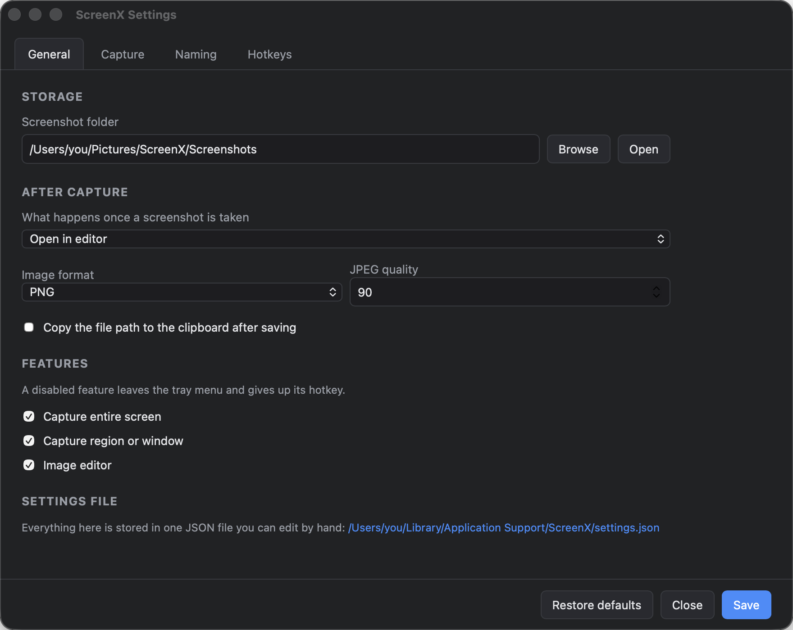
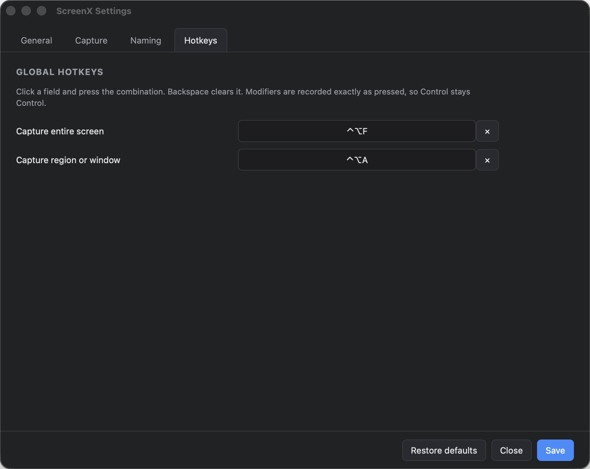

# ScreenX

Take a screenshot. Mark it up. Save it.

ScreenX is a screen capture tool for macOS and Windows. It keeps everything on
your computer. It does not upload your screenshots, it does not need an account,
and it contains no network code.

The application is 6.9 MB on macOS and 9.3 MB on Windows. The Windows installer
is 2.2 MB to download.

---

## Contents

- [Install](#install)
- [First run](#first-run)
- [Take a screenshot](#take-a-screenshot)
- [Mark up a screenshot](#mark-up-a-screenshot)
- [Settings](#settings)
- [Name your files](#name-your-files)
- [Keyboard shortcuts](#keyboard-shortcuts)
- [If something does not work](#if-something-does-not-work)
- [For developers](#for-developers)

---

## Install

### macOS

1. Open `ScreenX_0.2.1_x64.dmg`.
2. Move ScreenX into your Applications folder.
3. Start ScreenX.

The application is not signed yet. macOS shows a warning the first time. To
start it:

1. Open your Applications folder.
2. Hold the Control key and click ScreenX.
3. Click **Open**.
4. Click **Open** again in the warning.

You do this one time only.

### Windows

There are two Windows downloads. Use the one that you prefer.

**To install ScreenX:**

1. Run `ScreenX_0.2.1_x64-setup.exe`.
2. Start ScreenX.

The installer puts ScreenX in your Start menu. It also adds ScreenX to **Apps &
features**, so you can remove it there.

**To run ScreenX without an installation:**

1. Put `screenx.exe` where you want to keep it.
2. Start it.

`screenx.exe` is one file and it needs nothing next to it. To remove ScreenX,
delete the file. Your settings stay in `%APPDATA%\ScreenX`. Delete that folder
too if you do not want them.

The application is not signed yet. Windows shows a blue **Windows protected
your PC** window the first time. To continue:

1. Click **More info**.
2. Click **Run anyway**.

You do this one time only.

ScreenX needs the Microsoft Edge WebView2 Runtime. Windows 11 has it already,
and so do most Windows 10 computers, because Microsoft Edge installs it.

If the runtime is absent, the installer gets it for you. `screenx.exe` cannot do
this. On a Windows 10 computer that has no runtime, use the installer.

---

## First run

ScreenX puts an icon in the menu bar (macOS) or the notification area
(Windows). It has no main window. You use it from that icon or with a keyboard
shortcut.

> **PLACEHOLDER — screenshot: `docs/images/tray-menu.png`**
> The menu bar icon with its menu open. The menu shows "Capture Entire Screen",
> "Capture Region or Window", "Open Screenshots Folder", "Settings..." and
> "Quit ScreenX".

The settings window opens the first time you start ScreenX. Look at the
screenshot folder. Change it if you want to. Then click **Save**.

### macOS asks for permission

macOS must give ScreenX permission to read the screen. If your screenshots are
blank:

1. Open **System Settings**.
2. Go to **Privacy & Security** > **Screen Recording**.
3. Turn on **ScreenX**.
4. Start ScreenX again.

---

## Take a screenshot

### The whole screen

Press **Ctrl + Alt + F**. ScreenX captures the screen that your pointer is on.

### A part of the screen, or one window

Press **Ctrl + Alt + A**. The screen freezes and becomes dark. Now you have two
choices.

**To capture any rectangle:** hold the mouse button down, drag, then let go.

**To capture one window:** move the pointer over the window. Wait for a short
moment. The window becomes bright and a dashed line appears around it. Its name
appears in a small label. Click one time.

> **PLACEHOLDER — screenshot: `docs/images/overlay.png`**
> The selection overlay with a window highlighted: the screen dark, one window
> bright inside a dashed blue outline, and the size and title label above it.
>
> I did not make this screenshot, because it must show a real desktop. Take it
> yourself when your screen shows nothing private.

You do not have to choose a mode. Drag for a rectangle, or wait and click for a
window. The same tool does both.

While the overlay is open:

| To do this | Do this |
| --- | --- |
| Stop the window highlight | Hold Ctrl or Cmd while you move the pointer |
| Capture the whole screen | Press Enter |
| Cancel | Press Esc, or click the right mouse button |

**Esc always cancels.** The overlay covers the menu bar, so you cannot reach the
menu bar icon while the overlay is open. ScreenX takes the Esc key for as long
as the overlay is on the screen, and gives it back immediately after.

macOS shows only the windows that you can see. ScreenX cannot highlight a window
that is behind another window, or that is minimised. Bring the window to the
front first.

---

## Mark up a screenshot

The editor opens after each capture. You can change this in the settings.



### The tools

| Tool | What it does |
| --- | --- |
| **Select** | Move an item that you drew. Press Delete to remove it. |
| **Rectangle** | Draw a box. |
| **Ellipse** | Draw a circle or an oval. |
| **Arrow** | Draw an arrow. |
| **Line** | Draw a straight line. |
| **Freehand** | Draw a free line with the mouse. |
| **Highlighter** | Put a transparent colour over an area. |
| **Blur** | Hide an area. The pixels are destroyed. |
| **Pixelate** | Hide an area with large squares. |
| **Text** | Type words on the image. |
| **Step number** | Put a numbered circle on the image. Each click adds the next number. |
| **Crop** | Keep only the area that you drag. |
| **Cut out** | Remove a band, and join the two parts. |

### Blur hides information permanently

Use **Blur** or **Pixelate** to hide a password, a name or an address. Both
tools destroy the pixels. Nobody can get the original back from the saved file.

### How to cut out a band

**Cut out** removes a band from the image and joins the two parts together. Use
it to remove empty space from the middle of a long screenshot.

1. Select the **Cut out** tool.
2. Drag across the part that you want to remove.
3. Let go.

The shape of your drag sets the direction of the cut:

- Drag **wider than tall**. ScreenX removes a **full-height column**.
- Drag **taller than wide**. ScreenX removes a **full-width row**.

ScreenX shows the band in red while you drag. Press Ctrl+Z to undo.

### Colour and size

The second row of the toolbar sets the colour, the fill, the line width and the
text size. To change an item that you already drew, select it first.

### Save your work

| Button | What it does |
| --- | --- |
| **Save** | Write the file to your screenshot folder, and close the editor. |
| **Save As...** | Choose the name and the folder yourself. |
| **Copy** | Put the image on the clipboard. |

---

## Settings

Open the settings from the menu bar icon.



### General

| Setting | What it does |
| --- | --- |
| **Screenshot folder** | Where ScreenX writes your files. |
| **What happens once a screenshot is taken** | Open the editor, save the file, copy the image, or save and copy. |
| **Image format** | PNG or JPEG. PNG keeps all detail. JPEG makes smaller files. |
| **JPEG quality** | 10 to 100. A higher number gives better quality and a larger file. |
| **Copy the file path** | Put the path of the new file on the clipboard. |
| **Features** | Turn off a feature that you do not use. It leaves the menu and gives up its shortcut. |

### Capture

**Rest this long before a window highlights** sets the wait time in
milliseconds. The default is 400.

- Use a smaller number for a faster highlight.
- Use 0 to highlight as soon as the pointer moves over a window.
- Use a larger number if the highlight appears when you do not want it.

### Hotkeys



To change a shortcut:

1. Click the field.
2. Press the keys.

To remove a shortcut, click the field and press Backspace.

ScreenX records the keys exactly as you press them. If you press Control, you
get Control. ScreenX does not change Control into Command.

A shortcut works in every application, so choose a combination that no other
application uses. If another application already owns your combination, ScreenX
tells you after you save.

### The settings file

All settings are in one file. You can edit it in a text editor.

- macOS: `~/Library/Application Support/ScreenX/settings.json`
- Windows: `%APPDATA%\ScreenX\settings.json`

The **General** tab shows the path. Click the path to open the file.

ScreenX ignores a setting that it does not know, and uses the default for a
setting that is absent. You cannot stop the application from starting when you
edit this file.

---

## Name your files

ScreenX builds each file name from a pattern. The default pattern is:

```
ScreenX_%y-%mo-%d_%h-%mi-%s
```

It gives a name such as `ScreenX_2026-08-07_14-32-05.png`.

Each part that starts with `%` is a token. ScreenX replaces each token with a
value.

| Token | Value | Example |
| --- | --- | --- |
| `%y` | Year, 4 digits | 2026 |
| `%yy` | Year, 2 digits | 26 |
| `%mo` | Month, 2 digits | 08 |
| `%mon` | Month, short name | Aug |
| `%mon2` | Month, full name | August |
| `%d` | Day of the month | 07 |
| `%w` | Day of the week, short | Fri |
| `%w2` | Day of the week, full | Friday |
| `%wy` | Week number | 32 |
| `%h` | Hour, 24-hour clock | 14 |
| `%h12` | Hour, 12-hour clock | 02 |
| `%pm` | AM or PM | PM |
| `%mi` | Minute | 32 |
| `%s` | Second | 05 |
| `%ms` | Millisecond | 042 |
| `%unix` | Seconds since 1 January 1970 | 1786012325 |
| `%i` | A number that counts up | 7 |
| `%ra` | Random letters and digits | k3Bq7zR1pW |
| `%rn` | Random digits | 5820394617 |
| `%rx` | Random hexadecimal digits | 9f3c1a08bd |
| `%guid` | A random unique code | 5f2b8c14-… |
| `%t` | Name of the window or the screen | Example Window |
| `%width` | Width of the image | 1920 |
| `%height` | Height of the image | 1080 |
| `%un` | Your user name | you |
| `%cn` | Name of your computer | laptop |
| `%pn` | Name of this application | ScreenX |

### Set the width of a token

Put a number in braces after the token.

- `%i{4}` gives `0007`.
- `%ra{6}` gives 6 random characters.

### Rules

- ScreenX removes each character that a file name cannot contain.
- ScreenX never writes over a file. It adds ` (2)`, ` (3)` and so on.
- If you make a mistake in a token, the token stays in the name. This shows you
  the mistake.

The **Naming** tab shows an example of your pattern while you type it.

---

## Keyboard shortcuts

### Anywhere

| Keys | Action |
| --- | --- |
| Ctrl + Alt + F | Capture the whole screen |
| Ctrl + Alt + A | Capture a region or a window |

These are the defaults. Change them in the settings.

### In the selection overlay

| Keys | Action |
| --- | --- |
| Esc | Cancel |
| Enter | Capture the whole screen |
| Ctrl or Cmd (hold) | Stop the window highlight |

### In the editor

| Keys | Action |
| --- | --- |
| 1 to 9 | Select one of the first nine tools |
| Ctrl/Cmd + Z | Undo |
| Ctrl/Cmd + Shift + Z | Redo |
| Ctrl/Cmd + C | Copy the image |
| Ctrl/Cmd + S | Save |
| Ctrl/Cmd + Shift + S | Save As |
| Delete | Remove the selected item |
| Esc | Close the editor |
| Shift (hold while you drag) | Keep a rectangle square, or an ellipse circular |

---

## If something does not work

### My screenshots are blank or black

**macOS:** give ScreenX permission to read the screen. See
[macOS asks for permission](#macos-asks-for-permission).

**Windows:** a game in full-screen mode can capture as black. Set the game to
borderless-window mode.

### A window does not highlight

macOS reports only the windows that you can see. Bring the window to the front,
then try again.

Also make sure that the window is larger than 48 by 48 pixels. ScreenX ignores
smaller windows, because they are usually menu bar items and shadows.

### My shortcut does nothing

Another application has taken the same combination. Open the settings, go to
**Hotkeys**, and choose a different combination. If the system refuses a
combination, ScreenX tells you after you save.

### The overlay is on the screen and I cannot remove it

Press **Esc**. ScreenX holds the Esc key for as long as the overlay is open.

### The editor is slow with a very large image

Click the **Fit** button to change the zoom. This does not change the saved
image.

---

## For developers

- [`docs/TECHNICAL.md`](docs/TECHNICAL.md) — how ScreenX works inside: the
  architecture, the data flow, the coordinate systems, and how to build it.
- [`AGENTS.md`](AGENTS.md) — a map of the code for AI coding assistants.

Quick start:

```sh
npm install
npm run dev        # run it
npm test           # run the tests
npm run selfcheck  # check the real webview and window server
npm run build      # make an installer
```

---

## What is not here yet

**GIF recording.** An earlier version had it. It is paused until the screenshot
side is complete.

**A signed application.** Both builds are unsigned. macOS and Windows both warn
you the first time you start ScreenX.

**A test on more than one monitor on Windows.** ScreenX now runs on Windows.
Version 0.2.1 fixes a fault that stopped the program after you chose an area.
Screenshots, markup and saving are all tested on Windows 11 with one monitor.

Two monitors with different scale settings are not tested on Windows. The
position of your selection can be a small number of pixels out. Report what you
see.

---

## Licence

ScreenX: local screen capture and annotation.
Copyright © 2026 Brandon Doster.

ScreenX is free software. You can share it and change it under the terms of the
GNU General Public License, version 3. See [`LICENSE`](LICENSE).

ScreenX has no warranty.
